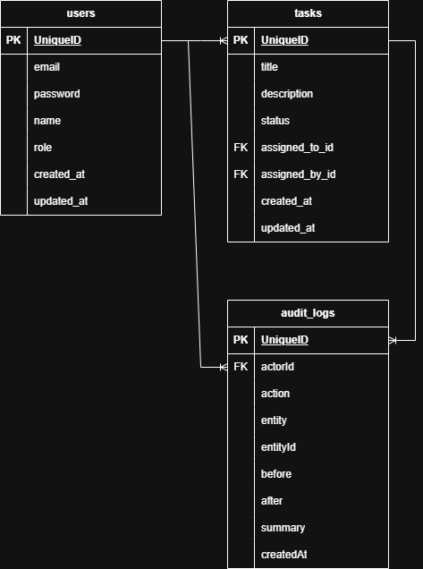

#  Techanalyticaltd  — NestJS + PostgreSQL + Prisma

Production-ready **NestJS 10** REST API backend for the Techanalyticaltd. Fully typed with TypeScript, validated with **Zod**, persisted with **Prisma + PostgreSQL**, and secured with JWT, RBAC, rate limiting, and Helmet.

## ERD Model



 
---

## Quick Start

### 1. Install dependencies
```bash
npm install
```

### 2. Configure environment
```bash
cp .env.example .env
# Edit .env — set DATABASE_URL, JWT secrets, etc.
```

### 3. Set up database
```bash
# Run migrations
npm run db:migrate

# Seed demo users
npm run db:seed
```

### 4. Start dev server
```bash
npm run start:dev
# API: http://localhost:8000/api
# Swagger: http://localhost:8000/api/docs
```

---
 
##  Response Format

Every response is wrapped by `TransformInterceptor`:
```json
{ "success": true, "data": <payload> }
```

Every error is handled by `AllExceptionsFilter`:
```json
{
  "success": false,
  "data": null,
  "code": "NOT_FOUND",
  "message": "User not found",
  "statusCode": 404,
  "details": [...]
}
```
This matches the frontend `ApiResponse<T>` and `ApiError` types exactly.

---

##  Testing

```bash
# Unit tests
npm test

# Unit tests with coverage
npm run test:cov

# Watch mode
npm run test:watch

# E2E tests (requires running test DB)
TEST_DATABASE_URL="postgresql://..." npm run test:e2e
```
 

##  Security Features

| Feature | Implementation |
|---|---|
| Password hashing | `bcryptjs` with configurable rounds (default: 12) |
| JWT signing | RS256-compatible secret, separate access/refresh secrets |
| HTTP-only cookies | `cookie-parser` + `httpOnly: true` on all auth cookies |
| CORS | Allowlist-based, `credentials: true` for cookies |
| Helmet | Security headers on all responses |
| Rate limiting | `@nestjs/throttler`: 100 req/min global, 10/min login, 5/min register |
| Input sanitization | Zod strips unknown fields, `toLowerCase()` on emails |
| SQL injection | Prisma parameterized queries — no raw SQL in business logic |
| RBAC | Guards on every protected route, decorator-driven |
| Token rotation | Refresh tokens rotated on every use |
| Soft delete | Users are deactivated, not hard-deleted (data integrity) |
| Email enumeration | `forgotPassword` returns success regardless of email existence |

---
 

## 📦 Production Deployment

```bash
# Build
npm run build

# Run migrations
npm run db:migrate:prod

# Start
npm run start:prod
```

### Environment checklist for production
- [ ] `JWT_ACCESS_SECRET` ≥ 32 random chars
- [ ] `JWT_REFRESH_SECRET` ≥ 32 random chars (different from access)
- [ ] `COOKIE_SECRET` ≥ 16 random chars
- [ ] `COOKIE_SECURE=true` (HTTPS only)
- [ ] `BCRYPT_ROUNDS=12` (min)
- [ ] `CORS_ORIGINS` set to your exact frontend domain
- [ ] `NODE_ENV=production`
- [ ] `DATABASE_URL` pointing to production DB

---
 